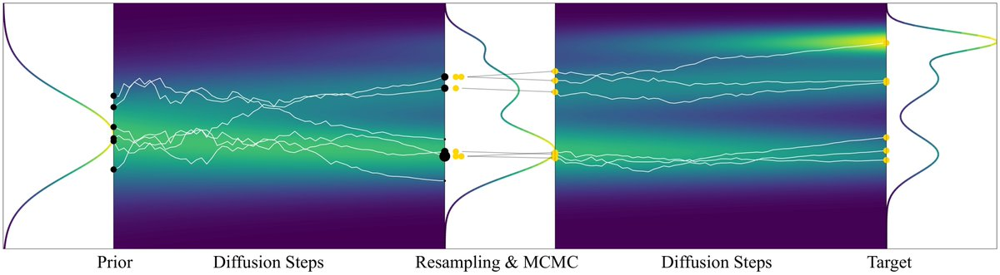

# Sequential Controlled Langevin Diffusions
<p align="center"></p>

This repository accompanies the paper "[Sequential Controlled Langevin Diffusions](https://arxiv.org/abs/2412.07081). [[`ICLR'25`](https://openreview.net/forum?id=dImD2sgy86)].

This repository builds on top of the repository for "[Beyond ELBOs: A Large-Scale Evaluation of Variational Methods for Sampling](https://arxiv.org/abs/2406.07423). [[`ICML'24`](https://openreview.net/forum?id=fVg9YrSllr),[`BibTeX`](#references)]". Many target densities and baseline methods are inherited from that repository. 

The Sequential Controlled Langevin Diffusions (SCLD) Algorithm targets the problem of sampling from an unnormalized density. Our method integrates two existing approaches to this problem, Sequential Monte Carlo (SMC) methods with Diffusion Samplers. SCLD can be understood both as a SMC algorithm with learnt proposals, or a diffusion sampler with added SMC steps during training and sampling. We implement SCLD [here](algorithms/scld/). 

## Available Target Densities
The table below provides a overview of target densities used in the paper.

|                                         | dim  | True log Z | Target Samples |
|-----------------------------------------|------|------------|----------------|
| [**Credit**](targets/german_credit.py)  | 25   | ❌          | ❌              |
| [**Seeds**](targets/seeds.py)           | 26   | ❌          | ❌              |
| [**Brownian**](targets/brownian.py)     | 32   | ❌          | ❌              |
| [**Sonar**](targets/sonar.py)           | 61   | ❌          | ❌              |
| [**LGCP**](targets/lgcp.py)             | 1600 | ❌          | ❌              |
| [**Phi4**](targets/phi4.py)             | variable | ❌          | ❌              |
| [**Robot**](targets/planar_robot.py)         | 10   | ❌         | ✔️             |
| [**Funnel**](targets/funnel.py)         | 10   | ✔️         | ✔️             |
| [**MoG**](targets/gmm40.py)             | any  | ✔️         | ✔️             |
| [**MoS**](targets/student_t_mixture.py) | any  | ✔️         | ✔️             |
| [**ManyWell**](targets/many_well.py) | any  | ✔️         | ✔️             |


The respective configuration files can be found [here](configs/target).

## Installation

First, clone the repo:

  ```
  git clone git@github.com:anonymous3141/SCLD.git
  cd SCLD
  ```

We recommend using [Conda](https://conda.io/docs/user-guide/install/download.html) to set up the codebase:
  ```
  conda create -n sampling_bench python==3.10.14 pip --yes
  conda activate sampling_bench
  ```
Install the required packages using 
  ```
  pip install -r requirements.txt
  ```
Finally, we use [`wandb`](https://wandb.ai/) for experiment tracking. Login to your wandb account:
  ```
  wandb login
  ```
  You can also omit this step and add the `use_wandb=False` command line arg to your runs.


## Running Experiments
We use [`hydra`](https://hydra.cc/) for config management. The [base configuration](configs/base_conf.yaml) file sets 
parameters that are agnostic to the specific choice of algorithm and target density. The `wandb` entity can be set in the [setup config file](configs/setup.yaml). Below, we supply several quickstart commands.

### SCLD 
```
python3 run.py algorithm=scld target=gaussian_mixture40
```

### SCLD without buffer
```
python3 run.py algorithm=scld target=gaussian_mixture40 algorithm.buffer.use_buffer=False
```

### CMCD baselines
As CMCD can be understood as a special case of SCLD with only 1 sub-trajectory, we run CMCD using the SCLD implementation

**CMCD-KL**:
```
python3 run.py algorithm=scld target=gaussian_mixture40 algorithm.buffer.use_buffer=False algorithm.loss=rev_kl target.scld.n_sub_traj=1 target.scld.max_diffusion=[max_diffusion] target.scld.initial_scale=[initial_scale]
```

**CMCD-LV**
```
python3 run.py algorithm=scld target=gaussian_mixture40 algorithm.buffer.use_buffer=False algorithm.loss=rev_lv target.scld.n_sub_traj=1
```


## References

If you use parts of this codebase in your research, please cite us using the following BibTeX entries.

```
@misc{chen2024sequentialcontrolledlangevindiffusions,
      title={Sequential Controlled Langevin Diffusions}, 
      author={Junhua Chen and Lorenz Richter and Julius Berner and Denis Blessing and Gerhard Neumann and Anima Anandkumar},
      year={2024},
      eprint={2412.07081},
      archivePrefix={arXiv},
      primaryClass={stat.ML},
      url={https://arxiv.org/abs/2412.07081}, 
}
```

## Acknowledgements
Portions of the project are adapted from other repositories (as mentioned in the code): 
- https://github.com/DenisBless/variational_sampling_methods is licensed under MIT,
- https://github.com/shreyaspadhy/CMCD is licensed under MIT,
- https://github.com/OlegArenz/gmmvi is licensed under MIT,
- https://github.com/lollcat/fab-jax is licensed under MIT,
- https://github.com/tomsons22/LDVI is licensed under MIT,
- https://github.com/juliusberner/sde_sampler is licensed under MIT,
- https://github.com/franciscovargas/denoising_diffusion_samplers is licensed under MIT,
- https://github.com/antoninschrab/mmdfuse is licensed under MIT,
- https://github.com/google-deepmind/annealed_flow_transport is licensed under Apache-2.0. 
